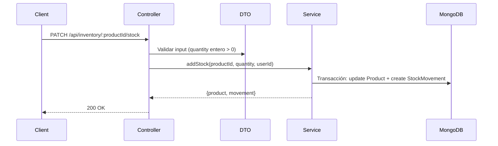

# Informe Spec: Agregar stock a inventario

- **Fecha inicio:** 2026-05-15
- **Fecha fin:** 2026-05-15
- **Estado final:** completada
- **Spec ID:** SPEC-2026-001

---

## 1. Resumen ejecutivo
Se solicitó un endpoint para agregar unidades de stock a productos existentes en el inventario, con trazabilidad completa. Se implementó `PATCH /api/inventory/:productId/stock` que actualiza el stock del producto y registra cada movimiento en una colección separada, ambos dentro de una transacción de MongoDB. El endpoint pasó verificación adversarial (2 iteraciones) y 11/11 tests cubren todos los criterios de aceptación y edge cases.

## 2. Qué se hizo
### Objetivo original
El sistema no tenía forma de agregar stock desde la API — los ajustes se hacían directamente en base de datos sin trazabilidad ni validación.

### Entregables producidos
| Entregable | Tipo | Ubicación |
|------------|------|-----------|
| Interfaz StockMovement | interfaz TypeScript | `src/inventory/interfaces/stockMovement.interface.ts` |
| Schema StockMovement | schema Mongoose | `src/inventory/schemas/stockMovement.schema.ts` |
| DTO AddStock | validación | `src/inventory/dto/addStock.dto.ts` |
| Método addStock | lógica de negocio | `src/inventory/inventory.service.ts` |
| Endpoint PATCH | controlador + ruta | `src/inventory/inventory.controller.ts`, `inventory.routes.ts` |
| Tests | unitarios + integración | `src/inventory/__tests__/addStock.spec.ts` |

### Criterios de aceptación cumplidos
- [x] Stock 50 + 20 = 70 y se registra el movimiento
- [x] Se guarda quién hizo el ajuste y la fecha
- [x] Producto inexistente → 404 con mensaje descriptivo
- [x] Cantidad <= 0 o no numérica → 400 con validación clara
- [x] Cada ajuste queda como registro tipo "entrada" con cantidad, producto, usuario y fecha
- [x] Múltiples ajustes reflejan la suma acumulada correcta

## 3. Cómo se planteó
### Estrategia elegida
Se eligió `PATCH` sobre el recurso existente (semánticamente correcto para modificación parcial) con una colección separada `StockMovement` para los movimientos, en vez de un array embebido en Product. Esto permite que los movimientos crezcan indefinidamente sin degradar las queries al producto.

### Decisiones clave
| Decisión | Por qué | Alternativa descartada |
|----------|---------|----------------------|
| PATCH en vez de POST | Modifica un recurso existente, no crea uno nuevo | POST /stock-movements — semánticamente menos claro |
| Colección separada StockMovement | Los movimientos crecen indefinidamente, embeber degradaría reads del producto | Array embebido en Product — no escala |
| Transacción de MongoDB | Garantiza atomicidad stock + movimiento | Operaciones separadas — riesgo de estado inconsistente |
| Validación en el controller (DTO) | Rechazar inputs inválidos antes de tocar la lógica de negocio | Validar en el service — llega basura a la capa de negocio |

### Arquitectura implementada

## 4. Cómo se ejecutó
### Fases completadas
| Fase | Estado | Observaciones |
|------|--------|---------------|
| SPEC | completada | 2 user stories, 7 edge cases catalogados |
| PLAN | completada | Arquitectura con transacción MongoDB definida |
| TASK | completada | 5 tareas descompuestas |
| CODE | completada | 5/5 tareas ejecutadas |
| QUALIFIED CODE | completada | Aprobado en 2da iteración |
| TESTER | completada | 11 tests, 11 pasaron, 0 fallaron |

### Tareas ejecutadas
| # | Tarea | Agente | Resultado |
|---|-------|--------|-----------|
| 1 | Crear interfaz y schema StockMovement | backend/nodejs | completada |
| 2 | Crear DTO de validación | backend/nodejs | completada |
| 3 | Implementar lógica en el service | backend/nodejs | completada |
| 4 | Agregar endpoint en controller y routes | backend/nodejs | completada |
| 5 | Escribir tests | verificacion/tester | completada |

### Iteraciones de verificación
- **Iteración 1 — RECHAZADO:** Faltaba validar que `productId` fuera un ObjectId válido de MongoDB. Un string arbitrario como `productId` provocaba un CastError de Mongoose que se traducía en un 500 Internal Server Error en vez de 400 Bad Request. Se corrigió agregando validación de ObjectId en el controller antes de llamar al service.
- **Iteración 2 — APROBADO:** 8/8 criterios cubiertos, 7/7 edge cases manejados, sin vulnerabilidades de seguridad detectadas.

## 5. Archivos creados o modificados
| Archivo | Acción | Descripción |
|---------|--------|-------------|
| `src/inventory/interfaces/stockMovement.interface.ts` | creado | Interfaz TypeScript con campos del movimiento |
| `src/inventory/schemas/stockMovement.schema.ts` | creado | Schema Mongoose con índices en product y createdAt |
| `src/inventory/dto/addStock.dto.ts` | creado | Validación: quantity entero, > 0, <= 1000000 |
| `src/inventory/inventory.service.ts` | modificado | Método addStock con transacción MongoDB |
| `src/inventory/inventory.controller.ts` | modificado | Handler PATCH con validación de ObjectId + DTO |
| `src/inventory/inventory.routes.ts` | modificado | Ruta PATCH con middleware de auth |
| `src/inventory/__tests__/addStock.spec.ts` | creado | 11 tests (7 unitarios + 4 integración) |

## 6. Métricas
- **Tareas totales:** 5
- **Tareas completadas:** 5
- **Tests escritos:** 11
- **Tests pasando:** 11
- **Iteraciones de QC:** 2
- **Criterios de aceptación:** 6/6

## 7. Lecciones aprendidas
- Siempre validar parámetros de URL (como ObjectId) en el controller, no solo el body. El verified code lo detectó en la primera iteración — sin QC adversarial esto habría llegado a producción como un 500 no manejado.
- Catalogar edge cases en la spec forzó a pensar en decimales, cantidades extremas y requests incompletos desde el inicio, evitando parches posteriores.
- La transacción de MongoDB requiere replica set — es un requisito de infraestructura que conviene verificar al inicio del plan, no al deployar.

## 8. Próximos pasos
- [ ] Crear endpoint para reducir stock (spec separada)
- [ ] Agregar endpoint de consulta de movimientos por producto (GET /api/inventory/:productId/movements)
- [ ] Verificar que el entorno de producción tiene replica set para soportar transacciones
- [ ] Considerar rate limiting en el endpoint para prevenir abuso
